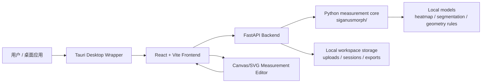
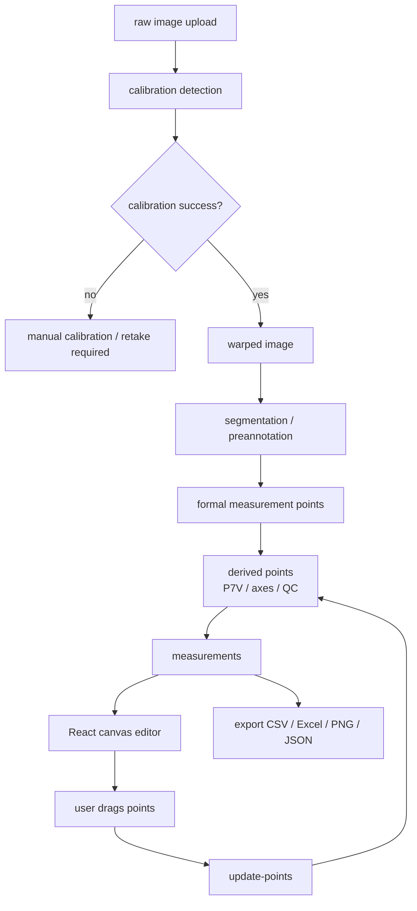

# SiganusMorph Local V2.0 前端重构方案

## 0. 边界声明

本文档仅用于规划 SiganusMorph Local 从 Streamlit V1.0 前台迁移到 React + FastAPI + Tauri 的 V2.0 架构方案。

本阶段不重写代码，不训练模型，不修改 `siganusmorph/` 测量算法，不修改 `corrected_keypoints`，不覆盖历史 batch measurement、final analysis 或 Review Queue 结果。Streamlit V1.0 作为软著冻结版继续保留。

## 1. 为什么从 Streamlit 迁移

Streamlit V1.0 已适合作为软著冻结版和快速科研验证工具，但它在正式桌面软件体验上存在天然限制：

1. **交互精度限制**  
   Streamlit 页面 rerun 机制不适合高频 canvas 拖拽、局部放大镜、键盘微调和实时测量预览。当前 V1.0 已通过自定义组件缓解，但仍不如原生 React 状态管理自然。

2. **前端状态复杂度上升**  
   单鱼测量需要同时管理 raw image、warped image、formal points、derived points、measurement overrides、unsaved state 和 export state。React 更适合拆分为可维护的组件和 store。

3. **桌面软件包装需求**  
   Tauri 可以提供更接近正式桌面软件的启动、窗口、文件选择、输出目录权限和安装包体验，同时比 Electron 更轻量。

4. **后端职责需要清晰隔离**  
   测量算法应长期保留在 Python core 中，FastAPI 作为稳定服务层负责 I/O、任务状态、测量调用和导出。这样便于未来接入队列、日志、批处理和测试。

5. **展示质量与可扩展性**  
   React/Vite 可以实现 Apple-inspired 设计风格、流畅动画、精准 canvas/SVG overlay、响应式布局和更成熟的用户体验。

## 2. 新架构图



### 2.1 模块职责

- `siganusmorph/`  
  保留为 Python measurement core。负责校准、warp、预标注、几何测量、P7V、measurement axis、QC、导出计算等核心逻辑。

- `backend/` 或 `siganusmorph_api/`  
  FastAPI 后端。负责上传文件、会话管理、调用 measurement core、返回 JSON、导出 CSV/Excel/PNG/JSON。

- `frontend/`  
  React + Vite 前端。负责页面、状态管理、canvas/SVG 点位编辑、实时测量展示、导出交互。

- `desktop/`  
  Tauri wrapper。负责桌面窗口、文件系统权限、本地 API 启动/连接、打包安装。

## 3. 目标目录结构

```text
SiganusMorph Local/
├── siganusmorph/                  # 保留：Python measurement core
├── backend/
│   ├── app.py                     # FastAPI app
│   ├── routers/
│   │   ├── upload.py
│   │   ├── calibration.py
│   │   ├── measurement.py
│   │   └── export.py
│   ├── schemas/
│   │   ├── calibration.py
│   │   ├── measurement.py
│   │   └── export.py
│   └── services/
│       ├── session_store.py
│       ├── image_store.py
│       └── measurement_service.py
├── frontend/
│   ├── index.html
│   ├── package.json
│   ├── src/
│   │   ├── app/
│   │   ├── pages/
│   │   ├── components/
│   │   ├── features/
│   │   ├── styles/
│   │   └── api/
│   └── vite.config.ts
├── desktop/
│   └── src-tauri/
├── docs/
└── app.py                         # 保留：Streamlit V1.0 冻结版入口
```

## 4. 前后端接口设计

### 4.1 会话模型

每次单鱼测量创建一个 `session_id`。会话内保存：

```json
{
  "session_id": "uuid",
  "image_name": "real_001.png",
  "specimen_id": "fish_001",
  "weight_g": 155.33,
  "raw_image": {
    "path": "...",
    "width": 4032,
    "height": 3024
  },
  "calibration_state": {
    "status": "not_run | success | failed | manual_required",
    "warped_image_url": "/api/assets/session/warped.png",
    "mm_per_pixel": 0.08421,
    "marker_count": 12,
    "message": ""
  },
  "formal_points": {},
  "derived_points": {},
  "measurements": {},
  "qc": {},
  "export_state": {}
}
```

### 4.2 坐标系统约定

V2.0 必须继续严格区分：

- `raw_image_coord`：上传原图坐标；
- `warped_image_coord`：校正图坐标，正式测量唯一坐标系；
- `display_coord`：前端 canvas/SVG 显示坐标；
- `export_coord`：导出 JSON 中的坐标，默认等同 warped image coordinate。

接口返回的关键点、测量点和派生点默认均使用 `warped_image_coord`。

## 5. 数据流



### 5.1 单鱼测量数据流

1. 用户上传 raw image。
2. 后端保存原图并返回 `session_id`。
3. 用户点击自动校准。
4. 后端调用 Python core，生成 calibration state 和 warped image。
5. 校准失败时前端阻止自动测量。
6. 校准成功后，后端基于 warped image 调用推荐测量流程。
7. 前端显示 warped image、formal points、P7V、body_midline_axis、体高线、尾柄高线。
8. 用户在 canvas/SVG 中拖拽点位。
9. 前端本地实时更新 display overlay 和临时测量；应用修改时调用 `/api/update-points`。
10. 后端重新计算 measurements 和 QC。
11. 用户保存或导出结果。

## 6. FastAPI API Endpoints

### 6.1 `POST /api/upload`

上传单张图片或批量图片。

Request:

```http
multipart/form-data
file: image
specimen_id?: string
weight_g?: number
```

Response:

```json
{
  "session_id": "uuid",
  "image_name": "sample.png",
  "raw_image_url": "/api/assets/{session_id}/raw.png",
  "status": "uploaded"
}
```

### 6.2 `POST /api/calibrate`

对指定 session 执行自动校准。

Request:

```json
{
  "session_id": "uuid",
  "manual_corners": null
}
```

Response:

```json
{
  "session_id": "uuid",
  "status": "success",
  "warped_image_url": "/api/assets/{session_id}/warped.png",
  "mm_per_pixel": 0.08421,
  "marker_count": 12,
  "raw_marker_overlay_url": "/api/assets/{session_id}/marker_overlay.png",
  "message": "calibration success"
}
```

失败时：

```json
{
  "session_id": "uuid",
  "status": "failed",
  "warped_image_url": null,
  "mm_per_pixel": null,
  "message": "calibration failed; manual correction required"
}
```

### 6.3 `POST /api/measure`

在校准成功后的 warped image 上运行推荐测量流程。

Request:

```json
{
  "session_id": "uuid",
  "preannotation_mode": "recommended",
  "measurement_axis_mode": "auto_qc_gated"
}
```

Response:

```json
{
  "session_id": "uuid",
  "coordinate_space": "warped_image",
  "formal_points": {
    "P1_snout_tip": [120.5, 260.1],
    "body_depth_upper": [430.2, 180.4],
    "body_depth_lower": [432.0, 360.8]
  },
  "derived_points": {
    "P7V_virtual_tail_tip": [980.0, 280.0]
  },
  "axes": {
    "body_midline_axis": [[120, 260], [300, 270], [520, 275]]
  },
  "measurements": {
    "TL_compressed_virtual_mm": 188.42,
    "TL_open_projection_mm": 181.90,
    "SL_mm": 152.31,
    "FL_mm": 174.22,
    "body_depth_mm": 49.18,
    "caudal_peduncle_depth_mm": 15.42
  },
  "qc": {
    "measurement_status": "needs_review",
    "warnings": []
  }
}
```

### 6.4 `POST /api/update-points`

应用用户拖拽后的点位，重新计算派生点、测量值和 QC。

Request:

```json
{
  "session_id": "uuid",
  "formal_points": {
    "P1_snout_tip": [121.0, 260.0],
    "body_depth_upper": [431.0, 180.0]
  },
  "measurement_overrides": {
    "P1_snout_tip": {
      "modified_by_user": true,
      "modified_at": "2026-06-19T10:20:00"
    }
  }
}
```

Response:

```json
{
  "session_id": "uuid",
  "formal_points": {},
  "derived_points": {},
  "measurements": {},
  "qc": {},
  "unsaved_changes": true
}
```

### 6.5 `POST /api/export`

导出当前会话结果。

Request:

```json
{
  "session_id": "uuid",
  "formats": ["csv", "xlsx", "json", "preview_png"],
  "save_confirmed_session": true
}
```

Response:

```json
{
  "session_id": "uuid",
  "files": {
    "csv": "/api/download/{session_id}/measurement.csv",
    "xlsx": "/api/download/{session_id}/measurement.xlsx",
    "json": "/api/download/{session_id}/formal_points.json",
    "preview_png": "/api/download/{session_id}/preview.png"
  },
  "saved_to": "results/formal_v2_user_outputs/"
}
```

## 7. React 页面结构

```text
frontend/src/
├── app/
│   ├── App.tsx
│   ├── routes.tsx
│   └── shell/
│       ├── AppShell.tsx
│       └── Sidebar.tsx
├── pages/
│   ├── HomePage.tsx
│   ├── SingleFishPage.tsx
│   ├── BatchMeasurementPage.tsx
│   ├── ExportPage.tsx
│   └── AdvancedToolsPage.tsx
├── features/
│   ├── upload/
│   ├── calibration/
│   ├── measurement/
│   ├── point-editor/
│   └── export/
├── components/
│   ├── Button.tsx
│   ├── Card.tsx
│   ├── StatusBadge.tsx
│   ├── MetricCard.tsx
│   ├── Toolbar.tsx
│   └── DataTable.tsx
├── api/
│   ├── client.ts
│   ├── upload.ts
│   ├── calibration.ts
│   ├── measurement.ts
│   └── export.ts
└── styles/
    ├── tokens.css
    └── global.css
```

### 7.1 页面清单

- 首页  
  软件简介、推荐流程、主要功能、适用图像条件。

- 单鱼测量  
  上传、校准、warped image、canvas/SVG 点位编辑器、实时测量指标、保存与导出。

- 批量测量  
  多图导入、批量任务状态、失败/复核统计、批量导出。

- 结果导出  
  展示简化测量表、完整字段导出、历史 V1/V2 输出读取。

- 高级工具  
  链接 V1.0 Streamlit Review Queue、历史评估结果、developer tools。默认不暴露调试字段。

## 8. Canvas 点位编辑器设计

### 8.1 推荐技术

优先使用 SVG overlay 或 Canvas + React state。推荐方案：

- 背景图使用 `` 或 canvas bitmap；
- 点位、线段、P7V、axis 使用 SVG overlay；
- 拖拽交互通过 pointer events；
- 局部放大镜使用 canvas crop；
- 键盘微调通过 selected point state；
- 前端本地实时计算常用距离；
- 点击“应用修改”后再同步到 FastAPI。

### 8.2 组件结构

```text
MeasurementEditor
├── ImageViewport
├── PointLayer
├── MeasurementLineLayer
├── AxisLayer
├── Magnifier
├── HoverTooltip
├── KeyboardNudgeController
└── LocalMeasurementPanel
```

### 8.3 点位交互

必须支持：

- 拖拽点位；
- hover 显示完整点名和坐标；
- visible radius 与 hit radius 分离；
- 方向键微调 1 px；
- Shift + 方向键微调 5 px；
- 拖动时十字准星；
- 局部放大镜 2x / 3x；
- 未保存修改状态；
- reset to auto measurement；
- apply changes；
- save confirmed result。

### 8.4 坐标映射

前端必须维护：

```ts
type CoordinateMapping = {
  imageWidth: number;
  imageHeight: number;
  displayWidth: number;
  displayHeight: number;
  scaleX: number;
  scaleY: number;
  offsetX: number;
  offsetY: number;
};
```

规则：

- 后端返回 warped image coordinates；
- 前端绘制时转换为 display coordinates；
- 用户拖拽后转换回 warped image coordinates；
- 所有保存和导出使用 warped image coordinates；
- 不允许 raw image coordinates 与 warped image coordinates 混用。

## 9. Apple-inspired Style Guide

### 9.1 色彩

- App background：`#f5f5f7`
- Card background：`#ffffff`
- Text primary：`#1d1d1f`
- Text secondary：`#707070`
- Primary CTA：`#0071e3`
- Border：`rgba(0, 0, 0, 0.08)`
- Success：`#34c759`
- Warning：`#ff9f0a`
- Error：`#ff3b30`

### 9.2 视觉原则

- 背景安静，内容卡片清晰；
- 标题克制，不使用过大 hero 字体；
- 主操作按钮使用 Apple blue；
- 状态提示轻量，不大量使用红色；
- 测量图像区域像专业工作区；
- 默认隐藏调试层和模型版本号；
- 高级工具与普通流程分离；
- 表格默认简化，完整字段折叠。

### 9.3 组件

- `AppShell`：固定侧边导航 + 主内容区域；
- `Card`：圆角 18-22 px，轻微阴影；
- `Button`：primary / secondary / subtle / danger；
- `StatusBadge`：success / warning / error / neutral；
- `MetricCard`：用于 TL、SL、FL、体高、尾柄高；
- `Toolbar`：编辑器顶部工具栏；
- `InspectorPanel`：右侧测量结果和点位信息；
- `Toast`：保存成功、导出完成、校准失败等反馈。

## 10. 与 V1.0 Streamlit 版的兼容策略

1. **V1.0 冻结保留**  
   `app.py` 和现有 Streamlit pages 作为软著冻结版继续保留，不在 V2.0 初期删除。

2. **核心算法复用**  
   `siganusmorph/` 不迁移到 TypeScript。FastAPI 直接调用 Python core。

3. **输出目录隔离**  
   V2.0 输出建议写入：

   ```text
   results/formal_v2_user_outputs/
   ```

   不覆盖 V1.0 的：

   ```text
   results/formal_v1_user_outputs/
   results/batch_measurement_v0.6.4_stable/
   results/realworld_review_*/
   ```

4. **JSON schema 兼容**  
   V2.0 保存字段尽量兼容 V1.0：

   - `image_name`
   - `specimen_id`
   - `weight_g`
   - `coordinate_space`
   - `calibration_state`
   - `formal_measurement_points`
   - `derived_points`
   - `measurement_overrides`
   - `measurements`

5. **高级工具过渡**  
   V2.0 高级工具页可以提供“打开 V1.0 Review Queue”的入口，但不将其作为普通测量流程。

6. **测试基线**  
   V2.0 必须使用 V1.0 相同测试图，确认：

   - 校准结果一致；
   - warped image coordinate 一致；
   - 自动测量结果一致；
   - 拖拽后测量重算一致；
   - 导出字段一致或明确新增。

## 11. 分阶段实施计划

### Phase 0：冻结和基线

- 标记 V1.0 Streamlit 冻结版；
- 记录当前 Python core 可调用入口；
- 整理正式输出 JSON schema；
- 准备 10-20 张 UI 回归测试图片。

### Phase 1：FastAPI 后端骨架

- 新增 FastAPI app；
- 实现 `/api/upload`；
- 实现 session store；
- 实现 asset static serving；
- 不接入复杂前端，只用 Swagger / curl 测试。

### Phase 2：校准和测量 API

- 接入 `calibrate_with_aruco`；
- 接入 `run_recommended_measurement`；
- 实现 `/api/calibrate` 和 `/api/measure`；
- 确保校准失败时不返回 fake `mm_per_pixel`；
- 输出 warped image 和 marker overlay。

### Phase 3：React/Vite 前端原型

- 建立 AppShell；
- 完成首页、单鱼测量静态布局；
- 实现上传和校准流程；
- 显示 raw image、warped image、校准状态。

### Phase 4：Canvas/SVG 点位编辑器

- 实现 MeasurementEditor；
- 支持拖拽、hover、键盘微调、局部放大镜；
- 本地实时更新测量预览；
- 点击 Apply 后调用 `/api/update-points`；
- 坐标 roundtrip 误差控制在 1-2 px 内。

### Phase 5：保存和导出

- 实现 `/api/export`；
- 导出 CSV、Excel、JSON、preview PNG；
- 输出目录隔离到 `formal_v2_user_outputs/`；
- 前端增加保存状态和下载入口。

### Phase 6：批量测量和结果导出

- 实现批量上传；
- 增加任务状态；
- 批量导出；
- 结果导出页支持读取 V2 输出表。

### Phase 7：Tauri desktop wrapper

- 创建 Tauri 项目；
- 打包 React frontend；
- 启动或连接 FastAPI backend；
- 配置文件选择、输出目录和本地权限；
- 生成 Windows 安装包。

### Phase 8：V2.0 验证

- 与 V1.0 同图同算法对比；
- 检查坐标一致性；
- 检查导出字段一致性；
- 检查拖拽、放大镜、键盘微调；
- 准备 V2.0 README 和用户手册。

## 12. 风险与控制

- **坐标混用风险**：所有 API 明确 `coordinate_space = warped_image`。
- **模型加载慢**：FastAPI 使用 lazy loading / singleton cache。
- **大图传输慢**：asset endpoint 支持缓存和缩略图。
- **批量任务阻塞**：后续可引入 background task 或队列。
- **V1/V2 输出混淆**：输出目录和 metadata 中写明 `frontend_version`。
- **Tauri 权限问题**：优先使用用户选择目录，不静默写系统目录。

## 13. 推荐下一步

1. 保留当前 Streamlit V1.0 软著冻结版。
2. 先做 FastAPI skeleton，不接入 Tauri。
3. 用一张固定样例图跑通 upload → calibrate → measure。
4. 再开发 React 单鱼测量页和 MeasurementEditor。
5. 最后接入批量测量、结果导出和 Tauri 打包。
