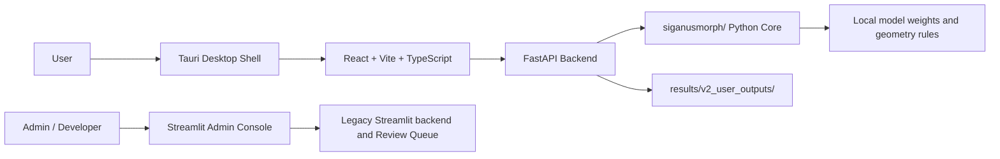

# SiganusMorph Local V2.0 Architecture

## Scope

V2.0 separates the product into a user-facing desktop app and an administrator console while preserving the existing `siganusmorph/` Python measurement core.

V1.0 Streamlit remains frozen for software-copyright use. V2.0 work does not train models, modify `corrected_keypoints`, or overwrite historical batch/final analysis.

## Components



## Data Flow

```text
raw image → calibration → warped image → segmentation/preannotation → formal points → measurements → export
```

Rules:

- Measurement is blocked if calibration fails.
- No fallback `mm_per_pixel = 0.1` is treated as success.
- The measurement workbench uses warped image and warped coordinates only.
- V2 user exports go to `results/v2_user_outputs/`.
- Future V2 admin outputs should go to `results/v2_admin_outputs/`.

## Directory Layout

```text
siganusmorph_v2/
├── backend/
├── frontend/
├── desktop/tauri/
├── admin_streamlit/
└── docs/
```

## Compatibility

- `siganusmorph/` remains the core measurement engine.
- V1.0 Streamlit files remain in place.
- Legacy Review Queue and developer tools are preserved.
- V2.0 adds new output directories instead of overwriting historical results.

